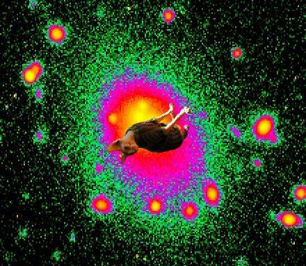
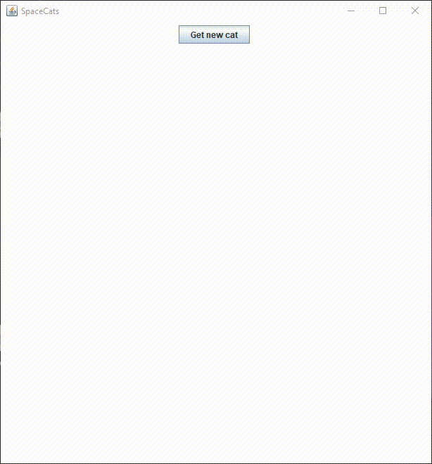

# SpaceCats — 👨‍🚀 + 🐱

This is a Java program I've written for [DALI Lab](http://dali.dartmouth.edu/)'s API Challenge. The program uses [NASA APOD API](https://api.nasa.gov/), [The Cat API](https://thecatapi.com/), and [remove.bg API](https://www.remove.bg/api) to generate images of SpaceCats (like the one below)!

## More SpaceCats
See [samples](/samples).

## Usage
It has a tiny GUI that runs with a simple button click and generates hilarious SpaceCats:
 

## Disclaimer
Please note that no copyright infringment is intended, and all the source images used to generate these images are the property of their respective owners.